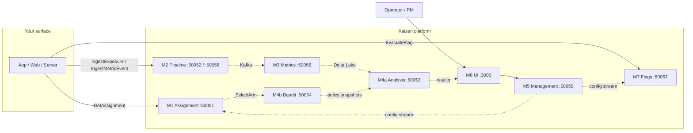

# 1. Introduction

> **What you'll learn**
> - What Kaizen Experimentation is and the problem it solves
> - The shape of the platform at a glance: seven modules, schema-first, one vocabulary
> - When Kaizen is the right tool, and when a lighter alternative is a better fit

## 1.1 What Kaizen is

Kaizen is an SVOD-grade experimentation and feature flag platform. You use it to make data-driven product decisions — ship a new player UI to 5% of users, decide whether the new homepage recommender actually lifts engagement, hold a treatment to a region while you wait for long-term effects, or keep an emergency kill switch on hand for a risky launch.

Under the hood, Kaizen is seven cooperating modules written in Rust, Go, and TypeScript, coordinated through a single Protobuf schema. You never need to know which language a module is written in to use the platform — the contract you program against is the schema — but you do need to know which module does what, because that map determines which port you connect to and which SDK method you call.

The platform covers the full experiment lifecycle end-to-end:

- **Assignment**: deterministic variant allocation, interleaving, and bandit arm delegation through the **M1 Assignment** service (port `50051`).
- **Ingestion**: exposure, metric, reward, and QoE event validation, deduplication, and Kafka emission through the **M2 Pipeline** service (ports `50052` for ingest and `50058` for orchestration).
- **Metric computation**: Spark SQL orchestration and Delta Lake storage through the **M3 Metrics** service (port `50056`).
- **Analysis**: all statistical inference — frequentist tests, CUPED, AVLM, e-values, synthetic control, switchback, offline RL — through the **M4a Analysis** service (port `50053`).
- **Bandits**: Thompson, LinUCB, Neural, slate, and constrained arm selection through the **M4b Bandit** service (port `50054`).
- **Management**: experiment CRUD, lifecycle transitions, RBAC, guardrails, and bucket reuse through the **M5 Management** service (port `50055`).
- **UI**: the operator console at **M6 UI** (port `3000`).
- **Feature flags**: boolean, string, JSON, and numeric flags with percentage rollouts and sticky bucketing through the **M7 Flags** service (port `50057`).

You will see these names and ports throughout the guide. They are canonical — they match the architecture table in [`CLAUDE.md`](../../../CLAUDE.md) and the service contracts in [`proto/experimentation/`](../../../proto/experimentation/).

Two non-obvious design choices shape how you integrate:

1. **Schema-first, everywhere.** Every module exposes its capabilities through `.proto` files in `proto/experimentation/<module>/v1/`. SDKs are thin wrappers over these contracts; if the SDK can't do something, you can always drop down to gRPC and talk to the module directly.
2. **Statistics live in one place.** All statistical computation — every p-value, every confidence interval, every variance estimate — is implemented in the Rust `experimentation-stats` crate and served by M4a. Go and TypeScript never do math on your behalf. This is why results are reproducible across surfaces: there is exactly one implementation.

## 1.2 What Kaizen is not

Kaizen is deliberately focused. It is *not*:

- **A product analytics tool.** Kaizen does not replace Amplitude, Mixpanel, or a BI layer. It computes experiment-scoped metrics and renders them in the results dashboard, but it does not store your generic event firehose for ad-hoc exploration. You still need a separate BI layer.
- **A customer data platform (CDP) or identity graph.** Kaizen does not resolve user identities across devices, stitch sessions, or manage marketing audiences. If you need those, feed identity-resolved attributes into Kaizen from your existing CDP.
- **A general-purpose feature configuration store.** M7 Flags is optimized for rollout control and experiment graduation. Configuration that never needs targeting, percentage rollouts, or audit trails belongs in a config store (etcd, Consul, a database table), not in Kaizen.
- **A data warehouse.** M3 writes Delta Lake tables for metric computation, but those tables are internal artifacts. Your warehouse is still yours; Kaizen integrates with it through federated reads rather than replacing it.

Keeping these boundaries sharp is what lets Kaizen be good at what it *does* do: turn a product hypothesis into a trustworthy decision.

## 1.3 Core capabilities at a glance

The platform supports the full range of experimental designs a large SVOD operator needs:

- **Classic controlled experiments.** A/B, A/B/n, and multivariate/factorial designs with frequentist, Bayesian, and sequential inference.
- **Interleaving.** Team Draft, Optimized, and Multileave interleaving for ranking experiments where users compare results directly.
- **Multi-armed and contextual bandits.** Thompson sampling, LinUCB, Neural (Candle-based), and slate bandits for continuous optimization where you care about cumulative reward rather than hypothesis testing.
- **Quasi-experimental designs.** Switchback experiments for marketplace and two-sided treatments, and synthetic control for geo-level interventions that cannot be randomized at the user level.
- **Feature flags with percentage rollouts.** Boolean, string, JSON, and numeric flags with sticky bucketing, targeting rules, kill switches, and clean graduation from experiment to permanent flag.
- **Sequential and always-valid inference.** AVLM (sequential CUPED), e-values with online FDR control, mSPRT, and group-sequential tests (GST), so you can peek at results safely and stop early when evidence is strong.

Chapter 11 walks through how to pick the right method; Chapter 12 covers bandit-specific workflows; Chapter 13 covers the more advanced quasi-experimental designs.

## 1.4 Platform concepts in one picture

Here is Kaizen from the perspective of a customer integration. Solid arrows are primary request paths; dashed arrows are background data flow.

A few things to lock in before Chapter 2 goes deeper:

- You, as the customer integrator, primarily talk to **M1**, **M7**, and **M2**. M5 is the management surface; you use it (directly or through M6) to create experiments, then your runtime talks to M1, M7, and M2 at request scale.
- M3, M4a, and M4b run behind the scenes. You read their output through M5 or M6 — you do not write your own SQL against M3, and you do not call M4a per request.
- The `experimentation-stats` crate is the only place statistical math lives. Every result you see in the dashboard was computed in Rust, regardless of which UI or SDK rendered it.

## 1.5 When to choose Kaizen — and when not to

Kaizen is the right choice when at least one of these is true:

- You run **SVOD-scale traffic** (millions of assignments per second is routine), and you need deterministic bucketing, low-latency assignment, and a pipeline that doesn't drop exposure events under load.
- You care about **statistical rigor** beyond "we hit significance." You want CUPED or AVLM for variance reduction, always-valid inference for safe peeking, and golden-file-validated implementations of the methods you use.
- You run **more than one experiment per surface** and need mutual exclusion, layers, holdouts, portfolio-level power analysis, and meta-experiments.
- You run **bandits or contextual bandits in production** and want the same platform to handle exposure tracking, reward ingestion, off-policy evaluation, and experiment graduation.
- You need **advanced designs** — interleaving for ranking, switchback for marketplaces, or synthetic control for geo tests — in addition to vanilla A/B.
- You have **compliance requirements** that need audit trails, RBAC, and controlled approval workflows for launches and kill-switch pulls.

Kaizen is probably overkill when:

- You ship one experiment per quarter on a small user base. A vendor like Optimizely, LaunchDarkly, Statsig, or Eppo will get you to a result faster, and you can always [migrate later](17-cookbook/README.md#1710-migrate-from-optimizely--launchdarkly--statsig--eppo).
- You only need percentage-based feature gates with no statistical analysis. A simpler flag service or even a config table will serve you better.
- You have no data engineering capacity. Kaizen expects you to produce metric events; if you can't emit events reliably or you don't have a warehouse for federated reads, a managed vendor with richer auto-instrumentation is a better fit.

> [!IMPORTANT]
> If you're not sure, read [Chapter 2 — Core Concepts](02-core-concepts.md) and [Chapter 3 — Architecture Overview](03-architecture-overview.md) first, then attempt the [15-minute quickstart in Chapter 4](04-quickstart.md). If you finish the quickstart without feeling like the platform is fighting you, Kaizen is probably the right fit.

## Next steps

- Continue to [Chapter 2 — Core Concepts](02-core-concepts.md) to learn the vocabulary you'll use in every later chapter.
- If you already know the concepts and want to see the module map up close, jump to [Chapter 3 — Architecture Overview](03-architecture-overview.md).
