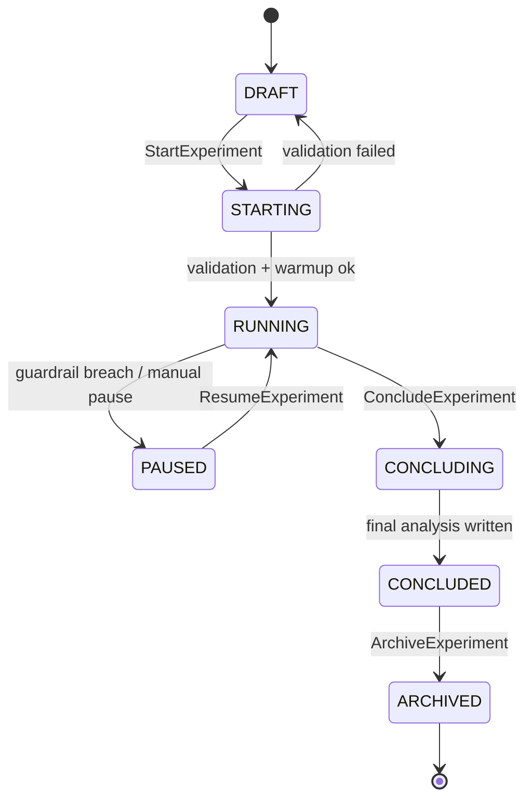

# 2. Core Concepts

> **What you'll learn**
> - The entities Kaizen exposes — experiments, variants, assignment units, metrics, guardrails, flags — and how they relate
> - Every lifecycle state an experiment can be in, and which transitions are valid
> - How bucketing actually works, why it's deterministic, and the privacy boundary you must respect

This chapter is the vocabulary source of truth for the rest of the guide. Later chapters and wave 2/3 agents will assume these definitions. If a term is used elsewhere, it means exactly what is defined here.

---

## 2.1 Entities

### 2.1.1 Experiment, Variant, Treatment, Holdout

An **Experiment** is a unit of decision-making: you are trying to learn whether an intervention changes an outcome. Every experiment has an ID, an owner, a traffic allocation, at least one metric, and a lifecycle state (§2.2). Experiments are the top-level object in M5 Management and are defined in [`proto/experimentation/common/v1/experiment.proto`](../../../proto/experimentation/common/v1/experiment.proto) as `Experiment`.

A **Variant** is one arm of an experiment. Every experiment has a control variant and one or more treatment variants; each variant carries a unique ID, a traffic weight, and optionally a payload (the configuration blob the SDK hands back to your code when a user is assigned to that variant). Variants are defined as `Variant` in the same proto file.

A **Treatment** is informal shorthand for "a non-control variant." When the guide says "the treatment lifted conversion by 1.2%," it is comparing a non-control variant to control.

A **Holdout** is a long-lived variant that deliberately receives no treatment and persists across multiple experiments in a layer. Holdouts are how you measure the *cumulative* impact of every shipped change on a stable slice of users. They are configured at the Layer level (see §2.1 and Chapter 7 for layers and mutual exclusion).

### 2.1.2 Assignment Unit

An **Assignment Unit** is the thing you randomize over. For most experiments this is a user, but Kaizen supports a family of units:

- **User** — persistent identity, usually a `user_id` from your auth system.
- **Device** — a device identifier (e.g., IDFV on iOS, a generated device UUID on Android/Web) — used when you cannot assume login.
- **Session** — a single session identifier, used when you want to re-randomize per visit (rare; most experiments are sticky).
- **Account** — a household or billing account; used when one subscription spans multiple profiles and you want all profiles to see the same variant.
- **Household** — an explicit household grouping distinct from account; used when account != household.

Which unit you choose determines the bucketing input (§2.3) and the sticky-assignment contract. The unit is part of the assignment configuration on the experiment; Kaizen will always hash the unit you declared, not whatever identifier the SDK happened to have on hand.

> [!IMPORTANT]
> Changing the assignment unit on a running experiment is never safe. If you need a different unit, conclude the experiment and create a new one.

### 2.1.3 Metric, Guardrail, Decision Criterion

A **Metric** is a numeric quantity computed from your event stream for the purpose of comparing variants. Metrics are defined in M5 (`CreateMetricDefinition`) and computed by M3. They come in six types, defined as `MetricType` in [`proto/experimentation/common/v1/metric.proto`](../../../proto/experimentation/common/v1/metric.proto):

| `MetricType` | Meaning | Example |
| --- | --- | --- |
| `METRIC_TYPE_MEAN` | Mean of a numeric value per unit | Average watch minutes per user |
| `METRIC_TYPE_PROPORTION` | Fraction of units with at least one event | Conversion rate |
| `METRIC_TYPE_RATIO` | Ratio of two sums (delta-method variance) | Revenue per session |
| `METRIC_TYPE_COUNT` | Count of events per unit | Plays per user per week |
| `METRIC_TYPE_PERCENTILE` | Percentile of a distribution | p95 time-to-first-frame |
| `METRIC_TYPE_CUSTOM` | Custom SQL executed by M3 | Anything the built-ins don't cover |

Metrics are classified by role on an experiment:

- **Primary metric** — the single metric that determines ship/no-ship. Exactly one per experiment.
- **Secondary metric** — metrics you track for context but that do not decide the experiment.
- **Guardrail metric** — metrics that *must not regress*; a guardrail breach can trigger automatic action.

A **Guardrail** is a metric plus a threshold and a `GuardrailAction`. The two actions, defined in [`experiment.proto`](../../../proto/experimentation/common/v1/experiment.proto), are:

- `GUARDRAIL_ACTION_AUTO_PAUSE` — M5 pauses the experiment, taking traffic to 0% and alerting the owner. This is the default. See ADR-008 for the rationale.
- `GUARDRAIL_ACTION_ALERT_ONLY` — fire an alert but keep traffic flowing. Must be opted into explicitly and is recorded in the audit trail.

A **Decision Criterion** is the combination of primary metric, required effect size, guardrail set, and statistical method you use to conclude the experiment. Chapter 7 covers decision criteria in depth; Chapter 11 covers the statistical methods.

### 2.1.4 Feature Flag vs. Experiment (and when a flag graduates)

A **Feature Flag** lives in M7 Flags and is for *rollout control*: turn a capability on for 1% of traffic, ramp to 100%, or kill it instantly. Flags come in four types (boolean, string, JSON, number) and are evaluated via `EvaluateFlag` or `EvaluateFlags` against the M7 service (port `50057`).

The rule of thumb:

- If you need to *decide whether to ship* something, run an **experiment**. Experiments have metrics, statistical analysis, and guardrails.
- If you have already decided and you just need to *control rollout safely*, use a **flag**. Flags have targeting rules and percentage rollouts but no built-in statistical analysis.

An experiment can **graduate** into a flag once it concludes. M7 exposes `PromoteToExperiment` (and its inverse pattern, graduation) so you can convert between the two without losing bucket stickiness. See Chapter 8 for the graduation workflow and [recipe 17.5 — "Convert a winning experiment to a permanent flag"](17-cookbook/README.md).

---

## 2.2 Lifecycle states

Every experiment has a state, defined as `ExperimentState` in [`proto/experimentation/common/v1/experiment.proto`](../../../proto/experimentation/common/v1/experiment.proto). States come in two flavors:

- **Stable** states describe a steady condition. An experiment can sit in a stable state indefinitely.
- **Transitional** states describe an in-progress handoff. An experiment moves through these automatically; you rarely act on them directly. See ADR-005 for the rationale for explicit transitional states.

| State | Stability | Meaning |
| --- | --- | --- |
| `EXPERIMENT_STATE_DRAFT` | Stable | Configured but not yet validated or started. No traffic. |
| `EXPERIMENT_STATE_STARTING` | Transitional | M5 is validating config, warming bandit policy, confirming metric availability, checking lifecycle segment power. M1 MUST NOT serve assignments for this experiment. |
| `EXPERIMENT_STATE_RUNNING` | Stable | Actively collecting data. For bandits, policy is adapting. |
| `EXPERIMENT_STATE_PAUSED` | Stable | Traffic paused due to guardrail breach or manual operator action. M1 MUST NOT serve assignments. Resume via `ResumeExperiment`. |
| `EXPERIMENT_STATE_CONCLUDING` | Transitional | Running final analysis, creating policy snapshots, computing surrogate projections, generating IPW estimates. M6 shows a progress indicator; result queries return 503. |
| `EXPERIMENT_STATE_CONCLUDED` | Stable | Analysis complete, results available, no longer collecting data. |
| `EXPERIMENT_STATE_ARCHIVED` | Stable | Retained for historical reference. Results still queryable. |

The valid transitions are enforced by M5. You drive transitions through these RPCs on `ManagementService`: `StartExperiment`, `PauseExperiment`, `ResumeExperiment`, `ConcludeExperiment`, `ArchiveExperiment`.

> [!WARNING]
> There is no "back to draft" transition from `RUNNING` or `CONCLUDED`. Once started, an experiment's configuration is effectively frozen. See §7.8 (editing a live experiment) for what you can and cannot change without creating a new experiment.

---

## 2.3 Bucketing model

Bucketing is the deterministic mapping from an assignment unit to a variant. Two properties matter:

1. **Determinism** — the same unit hashed with the same salt always lands in the same bucket. That is what makes assignments sticky and reproducible.
2. **Independence** — two different experiments with different salts produce uncorrelated bucket assignments for the same unit. That is what lets you run many experiments on the same traffic.

Kaizen uses **MurmurHash3 32-bit** over `(salt, assignment_unit_id)`. The hash output is mapped into a `[0, 10_000)` bucket space; variants claim contiguous bucket ranges proportional to their traffic weight.

The hash function and bucketing logic are implemented in the `experimentation-hash` Rust crate and mirrored in every SDK. The test vectors at `test-vectors/hash_vectors.json` are the cross-language contract: every SDK must produce the same bucket for a given input, or CI fails.

### Salt strategy

Every experiment gets a unique salt. The default salt is the experiment ID, which is sufficient for independence between experiments. For advanced cases:

- **Bucket reuse** (ADR-009): when you want a new experiment to share buckets with a previous one — for example, to prevent the same users from being exposed to multiple risky treatments back-to-back — M5 applies a 24-hour cooldown and reuses the salt from the predecessor experiment. Chapter 7 covers how to declare bucket reuse; recipe 17.6 walks through a concrete case.
- **Salt rotation**: to deliberately re-randomize (for example, if you discover a bias in the prior assignment), you can rotate the salt. The old assignments do not survive rotation — treat it like starting a fresh experiment.

### Carryover

**Carryover** is when a user's prior exposure to one variant contaminates their behavior in a later experiment. Kaizen cannot eliminate carryover in general, but bucket reuse plus explicit holdouts in a layer is the platform's defense against it. See §2.5 and Chapter 13 for interference and spillover mitigation.

---

## 2.4 Exposure vs. enrollment vs. trigger events

Three event types interact at assignment time, and conflating them is the most common source of bugs:

- **Assignment** is the act of M1 computing a variant for a unit. An assignment on its own is not an exposure — it just means "if the user were to encounter the experiment surface, this is what they would see."
- **Exposure** is the event you emit when the user *actually experiences* the variant — typically the moment the variant-specific UI renders or the variant-specific code path executes. Exposure is what anchors the user into the experiment's analysis. The canonical event is `ExposureEvent` in [`proto/experimentation/common/v1/event.proto`](../../../proto/experimentation/common/v1/event.proto), ingested via `IngestExposure` on M2.
- **Enrollment** is informal: it's the first exposure event the pipeline dedupes to, so "time of enrollment" means "time of first exposure." Kaizen does not have a separate enrollment event type.
- **Trigger events** are a specialized pattern for lazily-loaded features. You emit a trigger event to record that the user reached the code path where the variant would apply, even if the variant-specific rendering happens later. Trigger events are a subclass of exposure and share the same proto type; you distinguish them by metadata.

Metric events (`MetricEvent`), reward events (`RewardEvent`) for bandits, and QoE events are separate event types, each with its own RPC on M2 Pipeline. Chapter 9 covers the full event taxonomy and required fields.

> [!IMPORTANT]
> Call the assignment first, then emit the exposure **when and only when** the variant actually affects the user's experience. SDKs make this automatic when you use the standard render hooks; if you call the low-level API directly, it is on you to emit exposure correctly.

---

## 2.5 Guardrails and stop conditions

A **guardrail** (see §2.1.3) is a metric + threshold + action. M3 computes guardrail metrics on a schedule; when a threshold is crossed, M5 evaluates the `GuardrailConfig` and takes action:

- `GUARDRAIL_ACTION_AUTO_PAUSE` transitions the experiment to `EXPERIMENT_STATE_PAUSED` and raises an alert. You resume manually via `ResumeExperiment` only after you understand the cause. This is the default per ADR-008.
- `GUARDRAIL_ACTION_ALERT_ONLY` leaves the experiment running and raises an alert. Used rarely and recorded in the audit trail.

**Stop conditions** are separate from guardrails. A stop condition is a declarative rule — "stop when primary metric reaches significance with alpha = 0.05 under AVLM" — that causes M4a to emit a conclusion signal picked up by M5. Sequential methods (mSPRT, GST, AVLM, e-values) are the statistical foundation of safe stop conditions. Chapter 11 covers these in depth.

---

## 2.6 Privacy and PII boundaries

Kaizen is built around event ingestion, and events are where privacy mistakes happen. The rules:

- **You may send**: unit identifiers (user/device/session/account IDs), variant IDs, experiment IDs, timestamps, metric values, and attribute keys/values you have declared in the metric registry.
- **You must not send**: free-form text from user input, raw email addresses, payment details, precise location beyond the granularity the platform needs, or anything your privacy counsel has not approved as experiment-visible.
- **You must hash** identifiers that are sensitive but necessary for bucketing (e.g., hash email before using it as an assignment unit ID; Kaizen will not do the hashing for you).
- **PII redaction** is the customer's responsibility at emit time. M2 performs structural validation but does not scrub free-form strings.

User deletion flows (GDPR, CCPA, LGPD) are handled through M5's deletion endpoints; Chapter 15 covers the exact procedures.

> [!WARNING]
> If you emit a field Kaizen does not expect, M2 may still accept it — but it will show up in downstream tables and may leak into notebooks or exports. Treat event emission like any other privacy-sensitive write: review what you send, and prefer fewer fields.

---

## Glossary

This glossary is the source of truth for every later chapter. If you see any of these terms used elsewhere in the guide, they mean what they mean here.

| Term | Definition |
| --- | --- |
| **Arm** | A single choice in a bandit. Conceptually equivalent to a variant in a classic experiment; distinguished in the proto as `ArmSelection`. |
| **Assignment** | The act of computing a variant for an assignment unit. Performed by M1 Assignment. |
| **Assignment unit** | The entity randomized over — user, device, session, account, or household. See §2.1.2. |
| **AVLM** | Anytime-Valid regression-adjusted inference with Linear Models. Unifies CUPED with sequential monitoring. See ADR-015. |
| **Bandit** | An adaptive experiment that balances exploration and exploitation to maximize cumulative reward rather than test a hypothesis. Served by M4b. |
| **Bucket** | An integer in `[0, 10_000)` produced by hashing the assignment unit. Variants claim contiguous bucket ranges. |
| **Bucket reuse** | Deliberately sharing the same salt between two experiments so the same units land in the same buckets. Requires a 24-hour cooldown (ADR-009). |
| **CUPED** | Controlled-Experiment Using Pre-Experiment Data — variance-reduction technique that subtracts a pre-period covariate. |
| **Decision criterion** | The combination of primary metric, required effect, guardrails, and statistical method that decides whether to ship. |
| **E-value** | A sequential inference primitive; the reciprocal relates to always-valid p-values. See ADR-018. |
| **Exposure** | The event emitted when a user actually experiences a variant. See §2.4. |
| **Factorial design** | Multiple simultaneously varying factors in a single experiment. |
| **FDR** | False Discovery Rate. Online FDR control is offered via ADR-018. |
| **Feature flag** | Rollout control primitive served by M7. See §2.1.4. |
| **Graduation** | Converting a concluded experiment into a permanent feature flag. |
| **GST** | Group Sequential Tests. Alongside mSPRT per ADR-004. |
| **Guardrail** | A metric + threshold + action (auto-pause or alert-only). See §2.1.3 and ADR-008. |
| **Holdout** | A long-lived, no-treatment variant maintained across multiple experiments in a layer. |
| **Interleaving** | Ranking experimentation technique that mixes ranked lists from two systems. Team Draft, Optimized, and Multileave are supported. |
| **Layer** | A group of mutually exclusive experiments sharing a traffic pool. |
| **LinUCB** | Contextual bandit algorithm using linear upper confidence bounds. |
| **MurmurHash3** | The deterministic 32-bit hash used for bucketing. See §2.3. |
| **Metric** | A numeric quantity computed from the event stream. Six types, see §2.1.3. |
| **mSPRT** | Mixture Sequential Probability Ratio Test. Always-valid sequential test. |
| **Multi-armed bandit (MAB)** | A context-free bandit that balances exploration across a small set of arms. |
| **Multileave** | Multi-system generalization of interleaving. |
| **Policy** | The bandit's learned decision rule. Served by M4b. |
| **Proposal / arm selection** | Bandit's choice of arm for a given context. |
| **QoE event** | Quality of Experience event (startup time, rebuffering, etc.). Ingested via `IngestQoEEvent`. |
| **Reward event** | Bandit-specific event conveying the realized reward for a previous assignment. Ingested via `IngestRewardEvent`. |
| **Salt** | The bucketing hash salt. Usually the experiment ID; overridable for bucket reuse. |
| **Slate bandit** | A bandit that selects an ordered list (slate) of arms — e.g., a homepage ranking. See ADR-016. |
| **Stakeholder (of a metric)** | Who the metric represents: subscriber, provider, or platform. See `MetricStakeholder` enum. |
| **Stop condition** | A declarative rule that triggers experiment conclusion when satisfied. |
| **Switchback** | Time-based alternating assignment for marketplace and two-sided experiments. See ADR-022. |
| **Synthetic control** | Quasi-experimental method that constructs a weighted combination of untreated units as a counterfactual. See ADR-023. |
| **Team Draft interleaving** | The simplest interleaving method — draft picks alternate. |
| **Thompson sampling** | A Bayesian bandit algorithm. |
| **Trigger event** | A subclass of exposure used when the variant is lazily rendered. See §2.4. |
| **Variant** | One arm of a classical experiment. See §2.1.1. |

## Next steps

- Continue to [Chapter 3 — Architecture Overview](03-architecture-overview.md) to see how these concepts map onto the seven modules and their ports.
- If you want to jump straight to integration, the [15-minute quickstart in Chapter 4](04-quickstart.md) uses every concept in this chapter.
