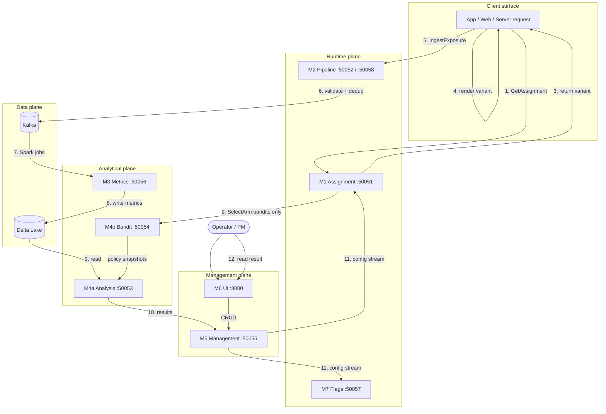

# 3. Architecture Overview (Customer-Facing)

> **What you'll learn**
> - Which Kaizen module you actually talk to for each integration task, and on which port
> - The data-flow path a single assignment takes, from client through pipeline to result
> - The supported deployment topologies and what SLAs you can expect from each

Chapter 1 gave you the module names and ports; Chapter 2 gave you the vocabulary. This chapter is the customer-facing map. It tells you which module to call for what, in what order, and what the data path looks like once you've done it.

---

## 3.1 Module map: which module you call for what

Kaizen has seven modules. From the perspective of an external integration, they split cleanly into three groups:

- **Runtime modules** (M1, M2, M7) — you call these from production traffic, at request scale. Latency matters.
- **Management modules** (M5, M6) — you call these from operator workflows: creating experiments, changing configuration, reading dashboards. Latency matters less, consistency matters more.
- **Backend modules** (M3, M4a, M4b) — you almost never call these directly. You consume their output through M5/M6 or through M1's bandit delegation.

| Module | Port | Language | You call this when... | Primary RPCs you use |
| --- | --- | --- | --- | --- |
| **M1 Assignment** | `50051` | Rust | You need to know which variant a user is in | `GetAssignment`, `GetAssignments`, `GetInterleavedList`, `GetSlateAssignment`, `StreamConfigUpdates` |
| **M2 Pipeline** | `50052` (ingest), `50058` (orch) | Rust + Go | You need to emit exposure, metric, reward, or QoE events | `IngestExposure`, `IngestExposureBatch`, `IngestMetricEvent`, `IngestMetricEventBatch`, `IngestRewardEvent`, `IngestQoEEvent` |
| **M3 Metrics** | `50056` | Go | (Rarely direct) triggering metric computation for a window | `ComputeMetrics`, `ComputeGuardrailMetrics`, `ExportNotebook` |
| **M4a Analysis** | `50053` | Rust | (Rarely direct) requesting a specific analysis; you normally read via M5/M6 | `RunAnalysis`, `GetAnalysisResult`, `GetInterleavingAnalysis`, `GetSwitchbackAnalysis`, `GetSyntheticControlAnalysis` |
| **M4b Bandit** | `50054` | Rust | (Rarely direct) M1 delegates here for bandit arms; you may call directly for slates | `SelectArm`, `GetSlateAssignment`, `SelectSlate`, `GetPolicySnapshot` |
| **M5 Management** | `50055` | Go (conditional Rust per ADR-025) | Creating experiments, metrics, layers, and targeting rules; transitioning lifecycle | `CreateExperiment`, `StartExperiment`, `PauseExperiment`, `ConcludeExperiment`, `CreateMetricDefinition`, `CreateLayer`, `StreamConfigUpdates` |
| **M6 UI** | `3000` | TypeScript (Next.js) | Operator console for humans | HTTP (not gRPC) |
| **M7 Flags** | `50057` | Go → Rust per ADR-024 | Evaluating a feature flag from your runtime | `EvaluateFlag`, `EvaluateFlags`, `CreateFlag`, `PromoteToExperiment` |

### 3.1.1 M1 Assignment (`:50051`)

M1 is the runtime entry point for variant allocation. It answers the question "which variant does this unit get?" It also handles interleaving (ranking experiments) and delegates to M4b for bandit arm selection when the experiment is a bandit.

When M1 is what you need:

- Your client (Web/iOS/Android) or server-side code needs a variant to render.
- You are running a classical A/B, A/B/n, multivariate, factorial, interleaving, or bandit experiment.
- You need a slate assignment for a ranked list (ADR-016).

M1 streams configuration from M5 via `StreamConfigUpdates` so it can make assignment decisions without hitting the database on every request. SDKs subscribe to the same stream and cache locally; Chapter 14 covers what happens when that stream is interrupted.

### 3.1.2 M2 Pipeline (`:50052` / `:50058`)

M2 is the runtime entry point for event ingestion. Port `50052` is the high-throughput ingest path (Rust, with Bloom-filter dedup and schema validation); port `50058` is the orchestration path (Go, for batch operations and control-plane flows).

When M2 is what you need:

- You are emitting `ExposureEvent` after a variant actually rendered.
- You are emitting `MetricEvent` for your declared metrics.
- You are emitting `RewardEvent` for bandit experiments.
- You are emitting `IngestQoEEvent` for quality-of-experience signals.

SDKs batch and retry on your behalf. If you are emitting directly over gRPC, you are responsible for batching — the `*Batch` RPCs (`IngestExposureBatch`, `IngestMetricEventBatch`, `IngestQoEEventBatch`) are the efficient path.

### 3.1.3 M7 Flags (`:50057`)

M7 is the feature flag surface. Flags are separate from experiments; see §2.1.4 in the core concepts for when to use which. M7 is a pure Rust service as of ADR-024.

When M7 is what you need:

- You want a percentage rollout ("ship to 10% of users") without statistical analysis.
- You want a kill switch you can flip instantly.
- You are converting a concluded experiment into a permanent rollout.

### 3.1.4 M5 Management (`:50055`) and M6 UI (`:3000`)

M5 is the CRUD surface. M6 is the operator console that renders M5's state for humans. Most integrations use M6 for day-to-day experiment creation and M5's API for CI-driven automation (for example, creating a canary experiment as part of a deploy pipeline).

When M5 is what you need:

- You are creating, updating, starting, pausing, resuming, concluding, or archiving an experiment.
- You are declaring a metric (`CreateMetricDefinition`) or layer (`CreateLayer`).
- You are subscribing to config updates from a custom service (`StreamConfigUpdates`).

M6 is the web console; it talks to M5 and to M4a for results rendering. You never need to program against M6 directly.

### 3.1.5 M3, M4a, M4b (backend)

These are the analytical backbone. Customers almost never call them directly:

- **M3 Metrics** computes metrics on Delta Lake via Spark SQL orchestration. You interact with M3 by declaring metric definitions in M5 and then reading computed results through M5/M6.
- **M4a Analysis** performs all statistical computation in the `experimentation-stats` Rust crate. You read analysis results through M5/M6 or, rarely, directly via `GetAnalysisResult`.
- **M4b Bandit** runs Thompson, LinUCB, Neural, and slate bandits on an LMAX-style single-threaded core (ADR-002). M1 delegates arm selection here; you only call M4b directly if you need a slate or want to inspect a policy snapshot.

> [!NOTE]
> The rule from [`CLAUDE.md`](../../../CLAUDE.md) stands without exception: **no statistical computation in Go or TypeScript**. If you find yourself tempted to reimplement a t-test or variance estimator in a language other than Rust, stop and ask instead for an M4a RPC that returns what you need.

---

## 3.2 Data flow: one assignment, end to end

This is the full path a single assignment takes through the platform, from the moment your client asks for a variant to the moment an operator reads the result in M6.

Walking the numbered steps:

1. Your client calls `GetAssignment` on **M1** with the assignment unit ID (user/device/session) and any targeting attributes.
2. If the experiment is a bandit, M1 calls `SelectArm` on **M4b** to get the chosen arm; otherwise it computes the variant from MurmurHash3 + salt locally.
3. M1 returns the variant (or bandit arm) to your client.
4. Your client renders the variant — the user now experiences the treatment.
5. Your client emits `IngestExposure` to **M2** to record that the variant rendered.
6. M2 validates the event schema, dedupes via a Bloom filter, and writes to Kafka.
7. Spark jobs orchestrated by **M3** consume the event streams.
8. M3 computes metrics and writes them to Delta Lake.
9. **M4a** reads Delta tables and performs statistical analysis — primary-metric inference, guardrail checks, variance reduction, sequential updates.
10. M4a returns results to **M5** (and persists them).
11. **M5** streams configuration to M1 and M7 via `StreamConfigUpdates`, so any operator-driven change (ramping traffic, pausing, concluding) propagates to runtime without a restart.
12. An operator reads the experiment result in **M6**, which queries M5.

For metric events, the flow is nearly identical — `IngestMetricEvent` replaces `IngestExposure` at step 5. For bandits, `IngestRewardEvent` feeds the policy update loop that M4b runs.

> [!IMPORTANT]
> Steps 1–5 are all on your request hot path. Steps 6–12 are asynchronous. This is why changing an experiment's configuration takes seconds to propagate (good) but new result data can lag minutes to hours (expected). Chapter 10 covers metric freshness in detail.

---

## 3.3 Deployment topologies

Kaizen supports three deployment shapes. Which you choose determines where the runtime modules run, who operates them, and what latency you can expect.

### 3.3.1 Managed (SaaS)

Kaizen runs the whole platform. You receive a regional endpoint for each module and integrate through SDKs or direct gRPC. This is the default for most customers.

- **Operational responsibility**: Kaizen (we run the control plane and data plane).
- **Your responsibility**: event emission, identity hygiene, metric definitions, experiment design.
- **Best for**: most customers. The shortest path from zero to running experiment.

### 3.3.2 Self-hosted

You run every module in your own Kubernetes or Nomad cluster, using our Helm charts and Terraform modules.

- **Operational responsibility**: yours end-to-end.
- **Your responsibility**: capacity planning, upgrades, incident response, regional failover.
- **Best for**: data residency requirements that managed cannot satisfy, or customers with very high traffic that wants control over cost tradeoffs.

### 3.3.3 Hybrid (edge assignment + central analytics)

You run **M1 Assignment** and **M7 Flags** at the edge (or in your own cluster) for low-latency assignment, while **M2 Pipeline**, **M3 Metrics**, **M4a Analysis**, **M4b Bandit**, **M5 Management**, and **M6 UI** remain centrally hosted.

- **Operational responsibility**: split. You run the runtime hot path; Kaizen runs the analytical backbone.
- **Your responsibility**: keeping your M1/M7 instances in sync with the central M5 config stream; ensuring your Kafka/event path can reach the central M2.
- **Best for**: customers with strict latency SLAs (sub-20ms variant fetch) or who need assignment resilience during central-region incidents.

Edge SDKs (Cloudflare Workers, Fastly Compute@Edge, Akamai EdgeWorkers) use a packaged M1 subset — see Chapter 6.7 once published for the details.

---

## 3.4 SLAs, regions, and latency expectations

Numbers below are the committed SLAs for the Managed deployment. Self-hosted customers inherit the same engineering targets but operate their own SLA.

| Module | p50 latency (same region) | p99 latency (same region) | Availability |
| --- | --- | --- | --- |
| M1 Assignment — `GetAssignment` | <5 ms | <20 ms | 99.95% |
| M1 Assignment — `GetAssignments` (batch) | <8 ms | <30 ms | 99.95% |
| M7 Flags — `EvaluateFlag` | <3 ms | <15 ms | 99.95% |
| M2 Pipeline — `IngestExposure` | <10 ms ack | <40 ms ack | 99.9% |
| M5 Management — `GetExperiment` | <30 ms | <150 ms | 99.9% |
| M3/M4a — metric & analysis freshness | <10 min | <30 min | 99.5% |

> [!NOTE]
> Latency numbers assume same-region calls. Cross-region calls inherit network RTT and can easily double the numbers above. Put your runtime callers (M1, M7, M2) in the same region as the Kaizen endpoint you're using.

### Regions

Managed Kaizen is currently deployed in `us-east`, `us-west`, `eu-west`, and `ap-southeast`. Regional pinning for data residency is available on request; see Chapter 15 for the compliance implications.

### Graceful degradation

When a Kaizen runtime module is unreachable, the SDKs fall back as follows. Chapter 14 covers the full disaster-recovery story; the short version:

- **M1 unreachable** → SDK serves the last-known variant from its local cache; if no cache, returns the declared default variant for each experiment. Exposure is *not* emitted — you will have a gap in analysis but not a visible outage.
- **M7 unreachable** → SDK returns the flag's declared default value. No rollout changes apply until M7 is back.
- **M2 unreachable** → SDK buffers events locally and retries with exponential backoff. Some loss is possible if the client terminates before recovery.
- **M5 unreachable** → runtime is unaffected (M1 and M7 have streamed configuration already); only new experiment creation, lifecycle transitions, and console operations stall.

> [!WARNING]
> The default variant is a load-bearing part of your experiment design. Do not set it to "unassigned" or leave it empty — always set it to a safe, shippable behavior, because it is what users see when Kaizen is degraded.

---

## Next steps

- Continue to [Chapter 4 — Getting Started (Quickstart)](04-quickstart.md) to put this module map to work — the quickstart walks you through calling M5, M1, and M2 in fifteen minutes.
- If you need to pick an authentication strategy before writing code, skip ahead to [Chapter 5 — Authentication, Authorization, and Tenancy](05-auth-and-tenancy.md).
