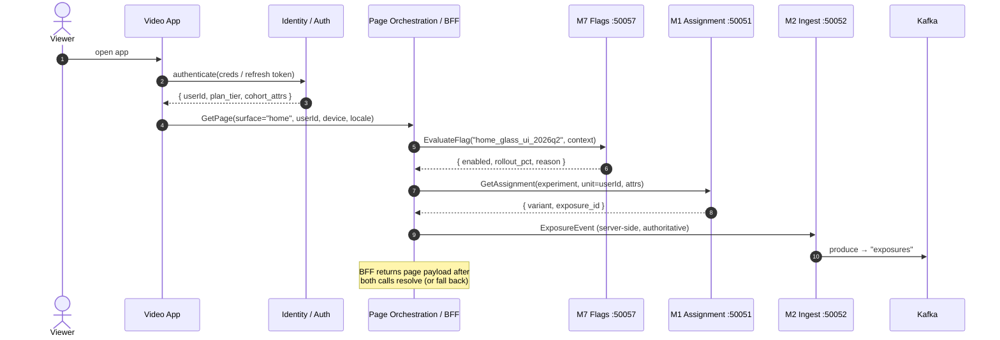
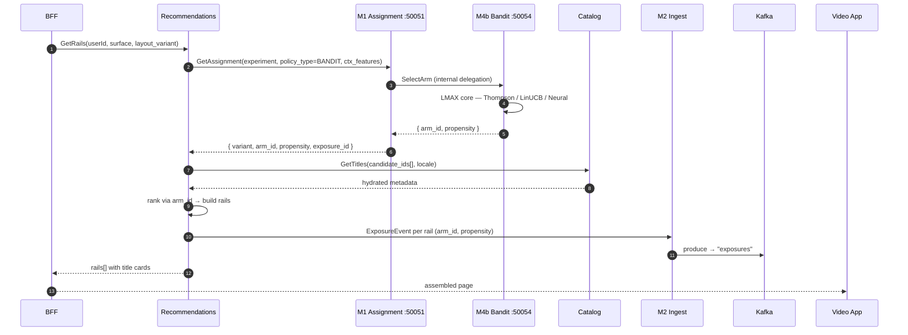
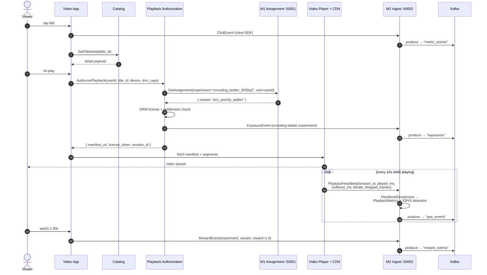
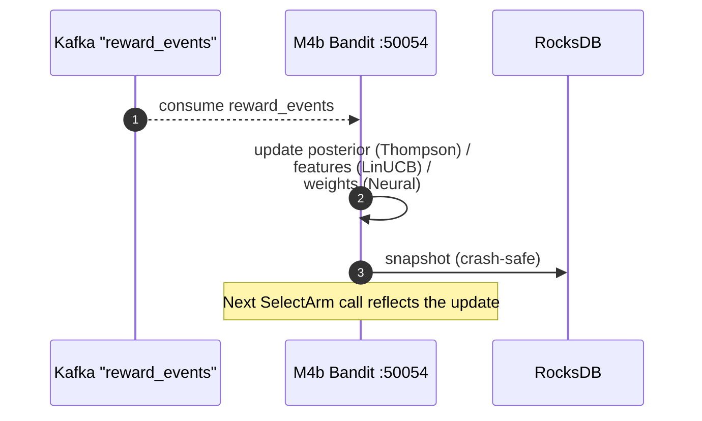
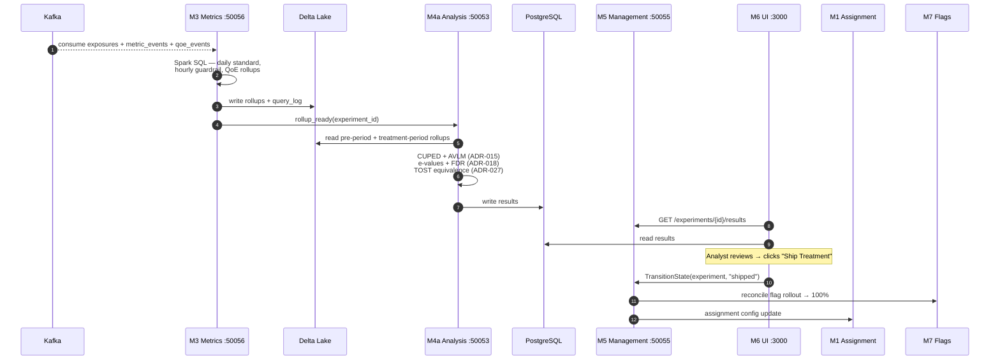
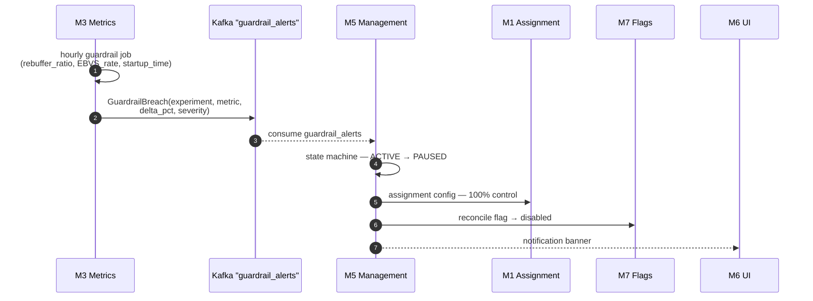

# Kaizen ↔ Streaming Video App — Sequence Walkthrough

**Audience**: client engineers, server engineers, and PMs integrating Kaizen
into an SVOD product surface (video-on-demand, live, or hybrid).

**Companion diagram**: `docs/design/streaming_video_sequence.mermaid` — the
canonical end-to-end sequence rendered as a single Mermaid file.

This guide walks the same flow as the `.mermaid` source, but in narrative
form with focused sub-diagrams per scenario. Read this when you want to
understand *why* each hop exists and how Kaizen plugs into the rest of a
streaming back-end (BFF, recommendations, catalog, playback authorization,
DRM, CDN). Read the `.mermaid` file when you want a single artefact to
embed in an architecture review.

---

## 1. Actors and ports

The numbered ports below are the gRPC ports declared in `CLAUDE.md` and the
top-level `justfile`. The customer-owned services (everything in the top
half of the table) sit outside the Kaizen workspace and integrate through
the SDKs in `sdks/` plus Kafka topics in `proto/`.

### Customer-side services (outside Kaizen)

| Actor                       | Role in the streaming app                                | Kaizen integration |
| --------------------------- | -------------------------------------------------------- | ------------------ |
| Viewer                      | End user                                                 | n/a                |
| Video App (iOS/Android/Web) | Client surface, render, in-app events                    | Kaizen **Client SDK** (`sdks/{ios, android, web}`) |
| Identity / Auth             | Login, refresh, account graph, plan tier                 | None — supplies the `userId` / cohort attrs that Kaizen hashes |
| Page Orchestration / BFF    | Assembles per-device home/detail pages from N microservices | Kaizen **Server SDK** (`sdks/server-go` or `server-python`) — calls M7 + M1 |
| Recommendations             | Generates per-user rails, slates, search ranking         | Server SDK — calls M1 with policy_type=BANDIT; M1 internally delegates to M4b |
| Catalog / Metadata          | Title, episode, artwork, badges                          | None — hydrates rail/detail payloads |
| Playback Authorization      | Entitlement check, manifest selection, DRM license       | Server SDK — calls M1 for encoding-ladder / codec experiments |
| Video Player + CDN          | Manifest fetch, segment streaming, QoE telemetry         | Emits heartbeats directly to M2 |

### Kaizen services (this repo)

| Actor             | Owned by | Port  | Talks via                       |
| ----------------- | -------- | ----- | ------------------------------- |
| M7 Flags          | Agent-7  | 50057 | gRPC (ADR-024 Rust port)        |
| M1 Assignment     | Agent-1  | 50051 | gRPC + WASM/UniFFI hash         |
| M4b Bandit        | Agent-4  | 50054 | gRPC, RocksDB snapshots         |
| M2 Ingest (Rust)  | Agent-2  | 50052 | gRPC + Kafka producer           |
| M2 Orchestration (Go) | Agent-2 | 50058 | Kafka consumer, query logging   |
| M3 Metrics        | Agent-3  | 50056 | Spark SQL + Delta Lake          |
| M4a Analysis     | Agent-4  | 50053 | Reads Delta, writes PostgreSQL  |
| M5 Management    | Agent-5  | 50055 | gRPC, PostgreSQL, Kafka         |
| M6 Analyst UI    | Agent-6  | 3000  | HTTP (Next.js 14)               |

Kafka topics in play (created by `redpanda-init` per
`docs/guides/streaming-integration.md`): `exposures`, `metric_events`,
`reward_events`, `qoe_events`, `guardrail_alerts`,
`model_retraining_events`, `model_training_requests`.

---

## 2. Where the SDK lives — client vs server

A frequent first-integration confusion is "do I put the Kaizen SDK on the
client or the server?" In an SVOD architecture with a BFF, the answer is
**both, with different responsibilities**:

| Decision type | SDK lives where | Why |
| --- | --- | --- |
| Page-level layout / UI variant | **Server SDK on the BFF** | BFF assembles the response; emitting the exposure server-side guarantees it lines up with what was actually returned |
| Rail / slate ranker (bandit arm) | **Server SDK on Recommendations** (calling M1, which delegates to M4b) | The ranker is the experiment; Recs is the caller. M4b is internal and only reachable through M1. |
| Encoding ladder / codec / DRM strategy | **Server SDK on Playback Authorization** | Playback authz owns manifest selection — the experiment lives where the decision is made |
| Client-only feature gate (e.g. new gesture, in-app debug overlay) | **Client SDK** | No server involvement needed; flag eval is local |
| Click / engagement / playback completion events | **Client SDK** | These are client-observable behaviors; the client knows when they happen |

Hash parity across SDKs (`test-vectors/hash_vectors.json`, validated by
`just test-hash`) guarantees the **same `userId` hashes identically**
whether the assignment is computed in Swift, Kotlin, TS, Go, or Python —
so a user re-assigned by the BFF after a client-side cache miss lands in
the same bucket they were already in.

---

## 3. End-to-end happy path

The canonical flow covers five phases plus one exception branch.

1. **Session start + page assembly** — Auth, then BFF fan-out to M7 + M1.
2. **Recommendations fan-out** — BFF → Recs → M1 (→ M4b internally) + Catalog.
3. **Title detail → Playback auth → Streaming + QoE** — App → Catalog,
   App → Playback Authorization → M1, then CDN streams while M2
   sessionizes heartbeats.
4. **Reward loop** — engagement reward feeds M4b posterior update.
5. **Offline analysis + ship** — M3 rollups, M4a inference, M5 lifecycle,
   M6 dashboard.
6. **Exception** — guardrail auto-pause triggered by M3 hourly job.

See `docs/design/streaming_video_sequence.mermaid` for the full rendered
sequence. The sub-flows below zoom in on each phase.

---

## 4. Phase 1 — Session start + page-level assignment

Key contracts:

- **Server-side exposures are authoritative.** Whichever service makes
  the variant decision emits the `ExposureEvent`. The BFF knows
  definitively that the user got the variant in the response — the
  client might receive bytes and then crash before render.
- **Identity is upstream of Kaizen.** Kaizen never authenticates anyone;
  it consumes `userId` + cohort attrs and hashes them. If you don't have
  a stable identity, that's a problem for `experimentation-hash`, not
  for `experimentation-assignment`.
- **Hash parity is non-negotiable.** Web (`sdks/web`), iOS, Android, and
  the server SDKs all use the same MurmurHash3 + salt. The
  `test-vectors/hash_vectors.json` golden file gates every SDK release.
- **ExperimentClient fallback chain.** If M1 is unreachable from the BFF, the
  server SDK falls through to the LocalProvider (WASM/CGo hash + cached
  config) and finally to static defaults (`DEFAULT_ASSIGNMENT`). See
  `docs/design/sdk_provider.mermaid`.

---

## 5. Phase 2 — Recommendations fan-out (bandit + catalog)

Why each hop matters:

- **Recs calls M1, not M4b directly.** M4b's `BanditPolicyService` is an
  **internal** Kaizen service — the proto comment says so explicitly
  (`proto/experimentation/bandit/v1/bandit_service.proto`: "Called by M1
  Assignment Service"). The Server SDKs do not expose an M4b client.
  Routing through `M1.GetAssignment` is what gives bandit experiments
  the same bucketing, targeting, lifecycle gating, and timeout fallback
  that static experiments get. M1 internally delegates to M4b via a
  low-latency gRPC call (p99 < 15ms) — see
  `crates/experimentation-assignment/src/bandit_client.rs`.
- **Different surfaces, different bandit policies.** Home, search,
  detail-page-rails, end-of-episode — each surface has its own ranker
  and policy. The policy registry lives in M4b; M5 owns the lifecycle
  binding from experiment → policy.
- **Propensity is the cost of being honest later.** The bandit emits an
  **IPW (inverse-propensity-weighted) probability** alongside the arm.
  M4a uses it for off-policy evaluation (ADR-017 — TC/JIVE surrogate
  fix, doubly-robust OPE). Without the propensity, you cannot compare
  a new ranker to the in-production one on logged data. Emit it on
  every exposure even if you only have one arm live — it'll be `1.0`
  and that's a valid value.
- **Catalog hydration is *not* a Kaizen concern.** The recs service
  pulls metadata from your existing catalog system; Kaizen never holds
  title metadata. This is intentional — the catalog ship cycle is
  different from the experimentation ship cycle.
- **Slate exposures (multi-slot rails) need a `slot_index`.** Slate
  bandits are scored as a unit, not per slot.

---

## 6. Phase 3 — Title detail → Playback authorization → Streaming + QoE

What's happening here:

- **Playback Authorization is its own experiment surface.** Encoding
  ladder, codec priority (AV1 vs HEVC vs H.264), per-tier bitrate caps,
  CDN selection — all of these are experiments that live inside the
  playback authz service. They have nothing to do with home page
  layout, and they should be in their own M1 experiments with their own
  guardrails (rebuffer ratio, startup time).
- **The HeartbeatSessionizer** lives in `experimentation-ingest` and
  rolls per-10s player heartbeats into a single `PlaybackMetrics`
  record per session. Per-heartbeat rows would explode `qoe_events`
  cardinality; the sessionizer keeps it at one row per session per
  ~minute window.
- **EBVS detection** (`ebvs_detected` on `PlaybackMetrics`) marks
  sessions that *requested* a play but never reached the first frame —
  usually a manifest fetch failure or a CDN timeout. EBVS is a
  first-class guardrail metric in M3. Spec:
  `docs/issues/ebvs-detection.md`.
- **The 30s engagement threshold** is the streaming-industry-standard
  "play start" definition. Use whatever your product defines as
  "engagement" — but be consistent across experiments. If you change
  the definition mid-experiment, throw away the results.
- **DRM is not Kaizen's problem.** License issuance, key rotation,
  device attestation — all of that lives in the playback authz service.
  Kaizen just records *which encoding variant* was authorized.

---

## 7. Phase 4 — Reward feedback loop

The bandit's update path is **single-threaded by design** — the LMAX
core serialises all reads and writes against a single in-memory policy
state. This is what lets us update the posterior on every reward without
locks while still serving thousands of `SelectArm` RPCs per second. The
RocksDB snapshot is the durability layer for restarts; it is not on the
hot path.

Cold-start handling (`experimentation-bandit/src/cold_start.rs`) kicks in
when an arm has fewer rewards than the configured floor — typically a
forced uniform exploration phase. Configure via the bandit policy spec
in M5, not in M4b directly.

---

## 8. Phase 5 — Offline analysis + ship decision

Notes that bite people on first integration:

- **M4a does all the math.** TypeScript in M6 *displays* results but
  never computes them. This is a hard architectural rule (`CLAUDE.md` §
  Critical Rules). If you find yourself doing a t-test in the UI, stop.
- **CUPED requires pre-period data.** If your experiment unit has fewer
  than ~14 days of historical metric values, CUPED won't reduce
  variance much and M4a will fall back to unadjusted analysis. Plan
  accordingly for new users / new content.
- **TOST is not just for refactors.** Any time the *expected* answer is
  "no change" — infra migration, codec swap, encoding ladder change,
  CDN switch — reach for TOST (ADR-027). Standard NHST will under-power
  you and you will ship a regression and call it a win.
- **The ship action is not a redeploy.** When M5 transitions an
  experiment to `shipped`, it reconciles to M7 (flag → 100%) and M1
  (assignment config). The customer-side services keep using the same
  flag-eval and assignment APIs — they just always get the treatment
  arm now.

---

## 9. Exception path — guardrail auto-pause

The auto-pause path is intentionally **same-mechanism** as a manual
pause: the analyst-driven `TransitionState` call and the M3-driven
`GuardrailBreach` both hit the M5 state machine. There is no separate
"auto" code path that can drift from the manual one.

Thresholds are configured per-metric on the experiment definition in M5
(`experimentation-management/src/validators.rs`). Severity bands map to
either alert-only, pause, or pause-and-rollback.

For streaming-specific guardrails, the standard set is:
- **Rebuffer ratio** (target: < 0.5%, alert at +20%, pause at +30%)
- **EBVS rate** (target: < 2%, alert at +15%, pause at +25%)
- **P95 startup time** (target: < 2s, alert at +500ms, pause at +1s)
- **Crash rate** (alert at +10%, pause at +25%)

---

## 10. Less-common flows you should know exist

These are documented elsewhere; the main sequence keeps them out to stay
readable.

- **Shadow mode (ADR-030 — Proposed).** Experiment runs candidate
  variants against production traffic but **does not change the
  user-visible surface**. The BFF or Recs service still receives a
  variant assignment, but the response uses the control variant.
  Exposures and metrics still flow through M2/M3, and M4a computes
  effects against the unchanged user response. Useful for validating a
  new model on real traffic before any user impact.
- **Holdout groups.** Permanent global control populations carved out
  at the server SDK layer (BFF, Recs, Playback) and excluded from all
  experiment assignments. The SDK short-circuits `GetAssignment` for
  these units and returns a sentinel variant.
- **Switchback (ADR-022).** Quasi-experimental design for marketplaces
  with strong interference — alternating treatment windows over time
  rather than randomising users. Useful for delivery-side experiments
  (CDN selection, regional encoder pools) where users share the same
  underlying resource pool.
- **Synthetic control (ADR-023).** Used when randomisation is not
  possible (geo-level rollouts, regulatory carve-outs, content-region
  experiments). Live in M4a; data path identical from the SDK's
  perspective.
- **Cross-modal calibration (ADR-029 — Proposed).** Cluster G —
  Personalization Orchestration. Relevant when a single ranker scores
  heterogeneous slates (video + manga + commerce) — the
  `experimentation-calibration` crate provides a unified NEV scale.

---

## 11. Where to look next

- `docs/design/streaming_video_sequence.mermaid` — single-file sequence
  diagram (the source of the embedded views above).
- `docs/design/offline_evaluation_sequence.mermaid` — companion sequence
  for the offline policy-evaluation flow (researcher → MLflow → M3 slice
  → M4a doubly-robust OPE → ship/shadow/reject decision).
- `docs/design/system_architecture.mermaid` — static architecture
  (modules, SDKs, storage, infrastructure), not flow.
- `docs/design/data_flow.mermaid` — data-flow view (Kafka topics +
  storage), not flow.
- `docs/design/sdk_provider.mermaid` — SDK resilience chain
  (Remote → Local → Default).
- `docs/guides/streaming-integration.md` — Kafka/Redpanda wire-level
  guide.
- `docs/guides/integration/` — customer integration guide (draft).
- `docs/issues/ebvs-detection.md`,
  `docs/issues/heartbeat-sessionization.md` — specs for the QoE pieces
  called out in Phase 3.
- ADRs called out above: 015 (AVLM), 017 (off-policy eval), 018
  (e-values + FDR), 022 (switchback), 023 (synthetic control), 024 (M7
  Rust port), 027 (TOST), 029 (cross-modal calibration), 030 (shadow
  mode).
