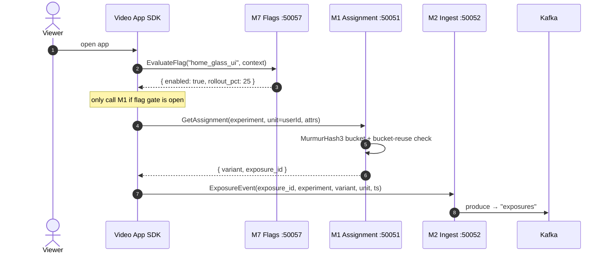
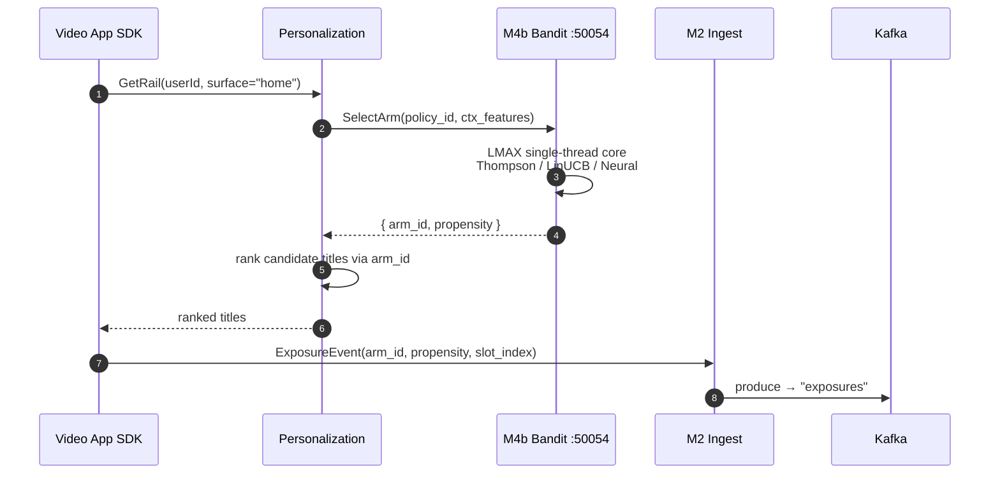
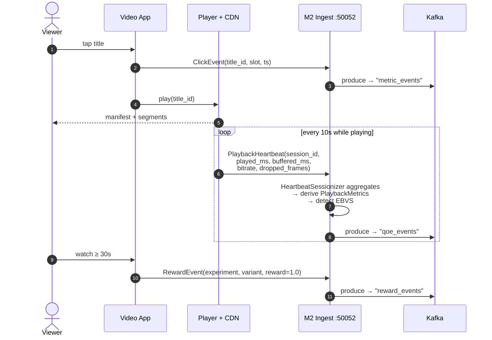
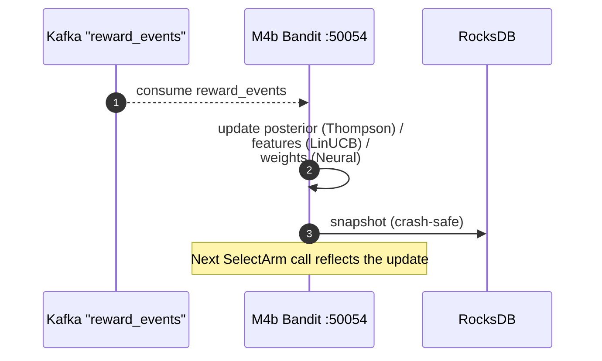
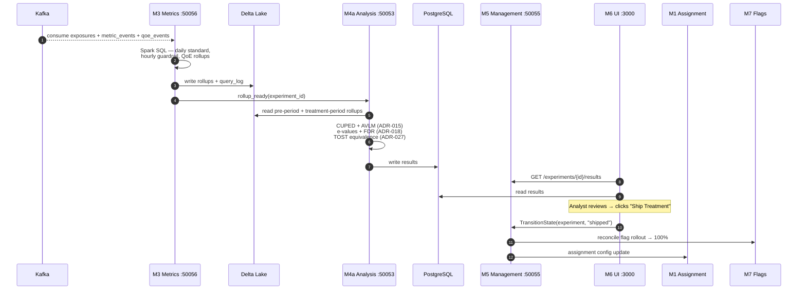
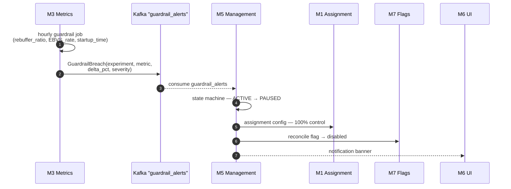

# Kaizen ↔ Streaming Video App — Sequence Walkthrough

**Audience**: client engineers, server engineers, and PMs integrating Kaizen
into an SVOD product surface (video-on-demand, live, or hybrid).

**Companion diagram**: `docs/design/streaming_video_sequence.mermaid` — the
canonical end-to-end sequence rendered as a single Mermaid file.

This guide walks the same flow as the `.mermaid` source, but in narrative
form with focused sub-diagrams per scenario. Read this when you want to
understand *why* each hop exists; read the `.mermaid` file when you want a
single artefact to embed in an architecture review.

---

## 1. Actors and ports

The numbered ports below are the gRPC ports declared in `CLAUDE.md` and the
top-level `justfile`. The customer-owned services (Video App,
Personalization, Player/CDN) sit outside the Kaizen workspace and integrate
through the SDKs in `sdks/` plus Kafka topics in `proto/`.

| Actor                       | Owned by  | Port  | Talks via                       |
| --------------------------- | --------- | ----- | ------------------------------- |
| Viewer                      | n/a       | n/a   | UI                              |
| Video App (iOS/Android/Web) | Customer  | n/a   | Kaizen SDKs (`sdks/{ios, android, web}`) |
| Personalization service     | Customer  | n/a   | gRPC to M4b, Kafka producer     |
| Video Player + CDN          | Customer  | n/a   | HTTP heartbeats to M2 ingest    |
| M7 Flags                    | Agent-7   | 50057 | gRPC (ADR-024 Rust port)        |
| M1 Assignment               | Agent-1   | 50051 | gRPC + WASM/UniFFI hash         |
| M4b Bandit                  | Agent-4   | 50054 | gRPC, RocksDB snapshots         |
| M2 Ingest (Rust)            | Agent-2   | 50052 | gRPC + Kafka producer           |
| M2 Orchestration (Go)       | Agent-2   | 50058 | Kafka consumer, query logging   |
| M3 Metrics                  | Agent-3   | 50056 | Spark SQL + Delta Lake          |
| M4a Analysis                | Agent-4   | 50053 | Reads Delta, writes PostgreSQL  |
| M5 Management               | Agent-5   | 50055 | gRPC, PostgreSQL, Kafka         |
| M6 Analyst UI               | Agent-6   | 3000  | HTTP (Next.js 14)               |

Kafka topics in play (created by `redpanda-init` per
`docs/guides/streaming-integration.md`): `exposures`, `metric_events`,
`reward_events`, `qoe_events`, `guardrail_alerts`,
`model_retraining_events`, `model_training_requests`.

---

## 2. End-to-end happy path

The canonical flow covers five phases plus one exception branch.

1. **App launch** — flag evaluation + experiment assignment (M7, M1).
2. **Personalized rail** — bandit arm selection through M4b.
3. **Playback** — QoE heartbeats into the `HeartbeatSessionizer` (M2).
4. **Reward loop** — engagement reward feeds M4b posterior update.
5. **Offline analysis + ship** — M3 rollups, M4a inference, M5 lifecycle
   transition, M6 dashboard.
6. **Exception** — guardrail auto-pause triggered by M3 hourly job.

See `docs/design/streaming_video_sequence.mermaid` for the rendered
sequence. The sub-flows below zoom in on each phase.

---

## 3. Phase 1 — App launch (flag + assignment)

Key contracts:

- **Hash parity is non-negotiable.** Web (`sdks/web`), iOS, Android, and
  the server SDKs all use the same MurmurHash3 + salt. The
  `test-vectors/hash_vectors.json` golden file gates every SDK release
  (`just test-hash`).
- **The exposure must be emitted before the user sees the treatment.** The
  SDK fires it synchronously on the same call that returns the variant —
  no batching, no debouncing, no "we'll send it later". Treatment effects
  collapse if exposures are missing for users who *did* see the variant.
- **ResilientProvider fallback.** If M1 is unreachable, the SDK falls
  through to the LocalProvider (WASM hash + cached config) and finally to
  static defaults (`DEFAULT_ASSIGNMENT`). See
  `docs/design/sdk_provider.mermaid`.

---

## 4. Phase 2 — Personalized rail (bandit arm)

Why the propensity matters:

- The bandit emits an **IPW (inverse-propensity-weighted) probability**
  alongside the arm. M4a uses it for off-policy evaluation (ADR-017 —
  TC/JIVE surrogate fix, doubly-robust OPE).
- Without the propensity, you cannot honestly compare a new ranker to the
  in-production one on logged data. Emit it on every exposure even if you
  only have one arm live — it'll be `1.0` and that's a valid value.
- Slate exposures (multi-slot rails) need a `slot_index`. Slate bandits are
  scored as a unit, not per slot.

---

## 5. Phase 3 — Playback + QoE telemetry

What's happening server-side:

- The **`HeartbeatSessionizer`** lives in `experimentation-ingest` and
  rolls per-10s player heartbeats into a single `PlaybackMetrics` record
  per session. Per-heartbeat rows would explode `qoe_events` cardinality;
  the sessionizer keeps it at one row per session per ~minute window.
- **EBVS detection** (`ebvs_detected` on `PlaybackMetrics`) marks sessions
  that *requested* a play but never reached the first frame — usually a
  manifest fetch failure or a CDN timeout. EBVS is a first-class guardrail
  metric in M3. Spec: `docs/issues/ebvs-detection.md`.
- The **30s engagement threshold** is the streaming-industry-standard
  "play start" definition. Use whatever your product defines as
  "engagement" — but be consistent across experiments. If you change the
  definition mid-experiment, you'll have to throw away results.

---

## 6. Phase 4 — Reward feedback loop

The bandit's update path is **single-threaded by design** — the LMAX core
serialises all reads and writes against a single in-memory policy state.
This is what lets us update the posterior on every reward without locks
while still serving thousands of `SelectArm` RPCs per second. The RocksDB
snapshot is the durability layer for restarts; it is not on the hot path.

Cold-start handling (`experimentation-bandit/src/cold_start.rs`) kicks in
when an arm has fewer rewards than the configured floor — typically a
forced uniform exploration phase. Configure via the bandit policy spec in
M5, not in M4b directly.

---

## 7. Phase 5 — Offline analysis + ship decision

Notes that bite people on first integration:

- **M4a does all the math.** TypeScript in M6 *displays* results but never
  computes them. This is a hard architectural rule (`CLAUDE.md` § Critical
  Rules). If you find yourself doing a t-test in the UI, stop.
- **CUPED requires pre-period data.** If your experiment unit has fewer
  than ~14 days of historical metric values, CUPED won't reduce variance
  much and M4a will fall back to unadjusted analysis. Plan accordingly
  for new users / new content.
- **TOST is not just for refactors.** Any time the *expected* answer is
  "no change" — infra migration, codec swap, encoding ladder change —
  reach for TOST (ADR-027). Standard NHST will under-power you and you
  will ship a regression and call it a win.

---

## 8. Exception path — guardrail auto-pause

The auto-pause path is intentionally **same-mechanism** as a manual pause:
the analyst-driven `TransitionState` call and the M3-driven `GuardrailBreach`
both hit the M5 state machine. There is no separate "auto" code path that
can drift from the manual one.

Thresholds are configured per-metric on the experiment definition in M5
(`experimentation-management/src/validators.rs`). Severity bands map to
either alert-only, pause, or pause-and-rollback.

---

## 9. Less-common flows you should know exist

These are documented elsewhere; the sequence diagram above keeps them out
of the main flow to stay readable.

- **Shadow mode (ADR-030 — Proposed).** Experiment runs candidate variants
  against production traffic but **does not change the user-visible
  surface**. The SDK still receives a variant assignment, but the player
  ignores it. Exposures and metrics still flow through M2/M3, and M4a
  computes effects against the unchanged user response. Useful for
  validating a new model on real traffic before any user impact.
- **Holdout groups.** Permanent global control populations carved out at
  the SDK layer and excluded from all experiment assignments. The SDK
  short-circuits `GetAssignment` for these units and returns a sentinel
  variant.
- **Switchback (ADR-022).** Quasi-experimental design for marketplaces
  with strong interference — alternating treatment windows over time
  rather than randomising users. M3 + M4a know how to roll up and analyse
  switchback windows; the streaming app side just needs to honour the
  M5-driven schedule.
- **Synthetic control (ADR-023).** Used when randomisation is not possible
  (geo-level rollouts, regulatory carve-outs). Live in M4a; data path
  identical to standard experiments from the SDK's perspective.

---

## 10. Where to look next

- `docs/design/streaming_video_sequence.mermaid` — single-file sequence
  diagram (the source of the embedded views above).
- `docs/design/system_architecture.mermaid` — static architecture (modules
  and storage), not flow.
- `docs/design/data_flow.mermaid` — data-flow view (Kafka topics +
  storage), not flow.
- `docs/design/sdk_provider.mermaid` — SDK resilience chain
  (Remote → Local → Default).
- `docs/guides/streaming-integration.md` — Kafka/Redpanda wire-level
  guide.
- `docs/guides/integration/` — customer integration guide (draft).
- `docs/issues/ebvs-detection.md`, `docs/issues/heartbeat-sessionization.md`
  — specs for the QoE pieces called out in Phase 3.
- ADRs called out above: 015 (AVLM), 017 (off-policy eval), 018 (e-values
  + FDR), 022 (switchback), 023 (synthetic control), 027 (TOST), 030
  (shadow mode).
